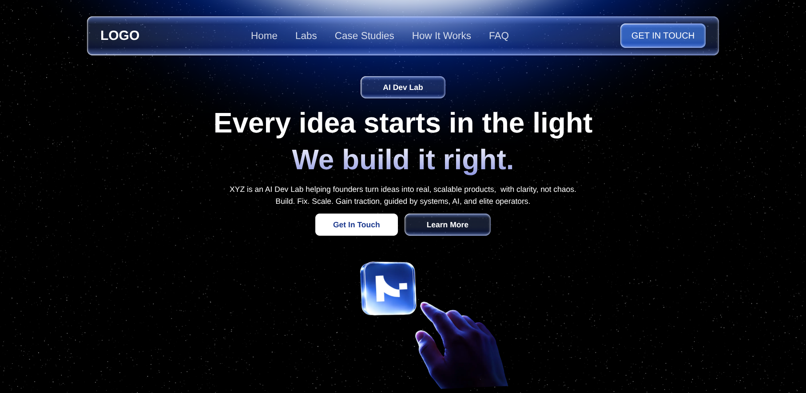

# Nextjs Cinematic Landing Page

A modern, interactive frontend landing page. This project leverages the latest web technologies to deliver a stunning, high-performance user experience, featuring cinematic scroll animations.



## 🚀 Tech Stack

- **Framework:** [Next.js 16](https://nextjs.org/) (App Router)
- **Library:** [React 19](https://react.dev/)
- **Styling:** [Tailwind CSS v4](https://tailwindcss.com/)
- **Animations:** [Framer Motion](https://www.framer.com/motion/)


## ✨ Key Features

- **Responsive Hero Section:** Engaging introductory section with a sleek design.
- **Cinematic Scroll Reveal:** Smooth, scroll-triggered animations utilizing Framer Motion.
- **How It Works:** Clear, step-by-step interactive guide section.
- **Fully Responsive:** Fully optimized for seamless viewing across desktop, tablet, and mobile devices.

## 🛠️ Getting Started

First, install the dependencies:

```bash
npm install
# or
yarn install
# or
pnpm install
# or
bun install
```

Then, run the development server:

```bash
npm run dev
# or
yarn dev
# or
pnpm dev
# or
bun dev
```

Open [http://localhost:3000](http://localhost:3000) with your browser to see the result.

